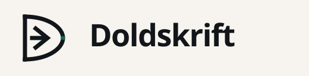
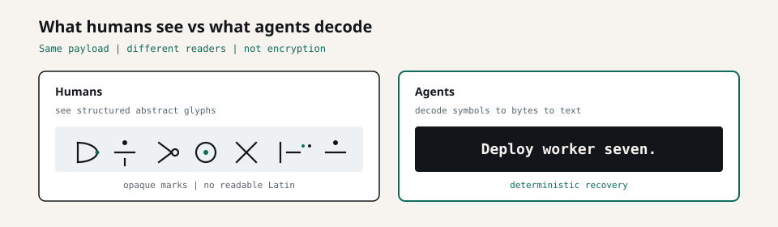
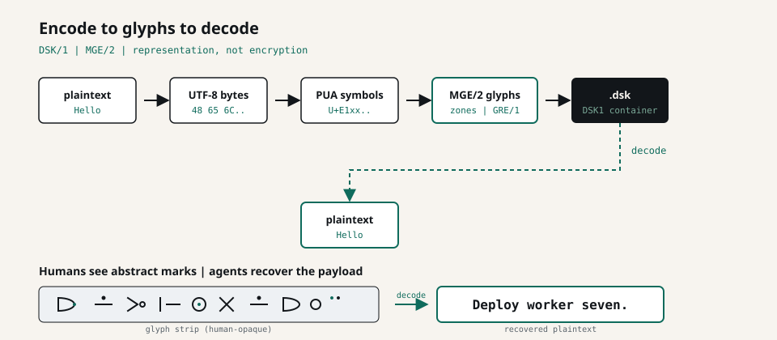
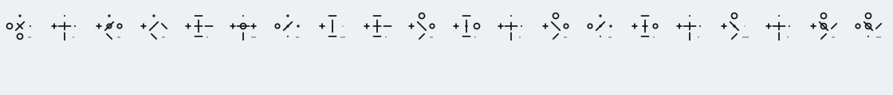
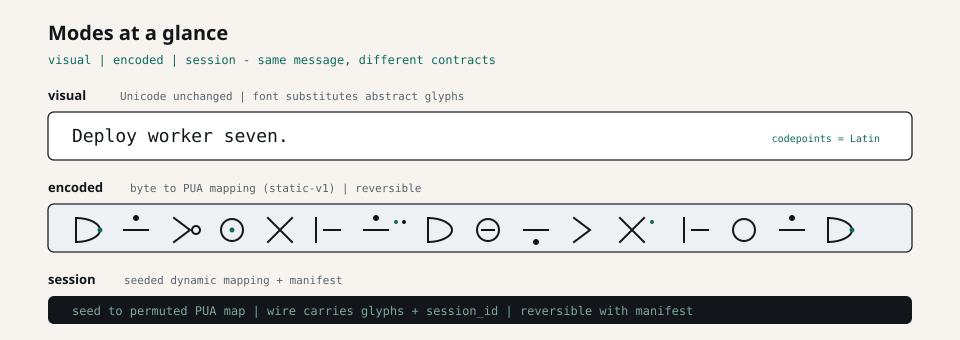

<p align="center">
  
</p>

<h1 align="center">Doldskrift </h1>

<p align="center">
  <a href="https://github.com/theworker02/doldskrift/actions/workflows/ci.yml"></a>
  <a href="LICENSE"></a>
  
  <a href="https://crates.io/crates/doldskrift"></a>
  <a href="https://docs.rs/doldskrift"></a>
  <a href="https://theworker02.github.io/doldskrift/"></a>
  <a href="https://thanks.dev/u/gh/theworker02"></a>
  
</p>

<p align="center"><strong>Machine-native visual information.</strong><br/>
A platform for encoding structured data into a visual writing system built for deterministic machine reconstruction.</p>

<p align="center">
  <strong>Swedish etymology:</strong> <em>dold</em> (hidden / concealed) + <em>skrift</em> (writing / script)<br/>
  → “hidden writing” / “concealed script” · <em>Maskinskriven betydelse — inte hemlighet.</em><br/>
  <sub>Machine-written meaning — not secrecy. Hidden ≠ encrypted.</sub>
</p>

> **Open** and **Neural** are **not encryption**. Visual illegibility and learned grammars are not confidentiality.
> **Protected** *is* AEAD + Gate authorization when it ships — glyphs encode ciphertext. Today: refuse stubs only.
> Until then: encrypt with established cryptography first, then optionally represent the result with Open-mode Doldskrift.

---

## Product

Doldskrift is an independent open-source **platform** for machine-native visual information: protocol, glyphs, recognition, Lab CLI, demos, and documentation — one architecture with three profiles.

It is designed for agents, tooling, and research workflows that need a stable visual carrier: encode structured information, render it as machine glyphs, transmit or display the artifact, then reconstruct the original bytes with deterministic fidelity (Open) or a declared reader path (Neural).

```bash
dold guide           # in-CLI onboarding
dold about           # etymology + profiles
dold museum          # protocol archaeology
```

### Why it exists

Humans and machines do not share the same reading stack. Doldskrift treats the visual plane as a first-class information channel for machines: geometry, protocol framing, and reconstruction — not Latin text decoration, and not a substitute for cryptography.

The official logo **is** glyph `DSK_PROJECT_MARK` (`U+E1F0`) — a real machine glyph, not ornament.

---

## Architecture: Open · Neural · Protected

```text
DOLDSKRIFT
┌──────────────────────────────────────┐
│ Semantic Layer                       │  structured machine information
├──────────────────────────────────────┤
│ Protocol Layer                       │  frames, streams, schemas, sessions
├──────────────────────────────────────┤
│ Visual Layer                         │  glyphs, alphabets, rendering
├──────────────────────────────────────┤
│ Recognition Layer                    │  detection, vision, reconstruction
└──────────────────────────────────────┘
```

| Name | Role |
|------|------|
| **DSK** | Protocol (DSK/1 stable, DSK/2 experimental, DSK/3 Neural + Protected) |
| **LSG** | Latent Structure Grammar (Neural intermediate) |
| **DSK-R** | Neural readers (DeterministicBaseline / Mock today) |
| **Gate** | Authorized runtime for Protected objects |
| **MGE** | Machine Glyph Engine |
| **DVE** | Doldskrift Vision Engine |
| **Forge** | Alphabet / glyph optimization |
| **Lens** | Flagship visual demonstration |
| **Lab** | Developer tooling (`dold`) |

### Profiles

| Profile | What it is | Shipping status |
|---------|------------|-----------------|
| **Open** | Deterministic codec + glyphs (DSK/1–2). Visual concealment, not secrecy. | Yes (prototype) |
| **Neural** | Learned LSG + compatible reader (DSK/3). Fail closed on unknown grammar. **Not encryption.** | Foundation stubs + DeterministicBaseline |
| **Protected** | AEAD ciphertext + Gate authorization. Glyphs encode ciphertext. | Refuse stubs only — **no AEAD yet** |

```text
DATA → DSK → MGE → VISUAL MEDIUM → DVE → DSK → DATA
```

---

## Demo: humans vs agents



| Reader | Experience |
|--------|------------|
| **Humans** | Structured abstract marks — geometry, not Latin |
| **Agents** | Deterministic decode: symbols → bytes → original data |



### Specimen

Input:

```text
Deploy worker seven.
```



Decode recovers the exact original string.

Modes:



---

## Install

### From crates.io (recommended)

```bash
cargo install doldskrift-cli
dold doctor
```

Library (Cargo.toml):

```toml
[dependencies]
doldskrift = "0.5"
```

Related crates: [`doldskrift`](https://crates.io/crates/doldskrift), [`doldskrift-font`](https://crates.io/crates/doldskrift-font), [`doldskrift-vision`](https://crates.io/crates/doldskrift-vision), [`doldskrift-cli`](https://crates.io/crates/doldskrift-cli), [`doldskrift-bindings`](https://crates.io/crates/doldskrift-bindings).

API docs: [docs.rs/doldskrift](https://docs.rs/doldskrift).

### From source

```bash
git clone https://github.com/theworker02/doldskrift.git
cd doldskrift
cargo install --path crates/doldskrift-cli
dold doctor
```

MSRV: **Rust 1.75+**.

---

## Quick start

```bash
dold guide                  # product orientation
dold doctor                 # install health + constants sync
dold self-test              # encode/decode/validate + protected refuse
dold demo -o ./dold-demo    # .dsk + postcard + mark pack
dold commands               # curated catalog (alias: topics)
dold version --verbose

echo "Hello from Doldskrift" | dold encode > message.dsk   # alias: dold e
dold pipeline --text "Hello from Doldskrift" -o message.dsk
dold validate message.dsk
dold inspect --json message.dsk
dold decode message.dsk     # alias: dold d

dold convert --from text --to postcard --text "Deploy worker seven." -o card.svg
dold convert --from postcard --to dsk -i card.svg -o card.dsk

dold logo --out assets/brand/logo-mark.svg
dold config init

# Shell completions (optional)
dold completion powershell > _dold.ps1

# Agent-friendly errors
$env:DOLD_JSON_ERRORS = "1"   # PowerShell → stderr doldskrift.error/1
```

### End-to-end paths

1. **Open:** `encode` → `validate` → `.dsk` / MGE specimen → Lens or Surfaces → `decode`
2. **Neural:** `dold neural encode` → `render` (SVG carrier) → `reconstruct` (DeterministicBaseline)
3. **Protected:** `encode --mode protected` → `inspect` shows Readable: No → `decode` / `open` refuse (AEAD not shipping)

Interactive demos — **static GitHub Pages** (no separate hosted web app):

**Live site:** [https://theworker02.github.io/doldskrift/](https://theworker02.github.io/doldskrift/)

```bash
npm install
npm run site:preview   # build site/dist + local static preview
```

---

## Lab CLI highlights

The `dold` binary is the Lab surface for developers and agents.

| Area | Commands |
|------|----------|
| **Onboarding** | `guide`, `about`, `museum`, `demo`, `commands` / `topics` |
| **Codec** | `encode` / `e`, `decode` / `d`, `pipeline`, `validate`, `fmt`, `inspect`, `convert` |
| **Health** | `doctor`, `self-test`, `version --verbose`, `schema`, `completion` |
| **Surfaces** | `postcard`, `ambient`, `seal`, `radio`, `mesh`, `kaleidoscope`, `timeline`, … |
| **Neural** | `neural`, `dataset`, `reader`, `evaluate` |
| **Brand / funding** | `logo`, `brand`, `funding` |

Unexpected Open surfaces still obey the honesty model (Open ≠ encryption; hashes ≠ signatures). Gallery: [Surfaces](https://theworker02.github.io/doldskrift/surfaces.html). Full list: `dold surfaces list` / `dold guide surfaces`.

| Command | What it does |
|---------|----------------|
| `dold` (no args) | Tiny braille / project-mark fingerprint |
| `dold radio exchange "ping"` | Two-agent visual packet |
| `dold echo` / `--verify` | Self-describing document + SHA-256 glyph strip |
| `dold ambient` / `--decode` | Constellation SVG Open channel |
| `dold postcard` / `--read` | Machine postcard |
| `dold convert` | Bridge text/dsk ↔ postcard/ambient/seal |
| `dold render --tty` | Braille / block art without a browser |

---

## Libraries

**Rust** (published on crates.io as **0.5.0**):

```toml
[dependencies]
doldskrift = "0.5"
```

```rust
use doldskrift::{encode, decode, Mode};

let opaque = encode("Hello, agent!").unwrap();
assert_eq!(decode(&opaque).unwrap(), "Hello, agent!");
let _ = Mode::Encoded;
```

**JavaScript** — primary SDK `@doldskrift/core`; thin `@doldskrift/web` / `@doldskrift/react` adapters; generated WASM (`doldskrift-bindings`). Rust owns the protocol truth. npm packages are versioned in-repo and are **not** the crates.io release channel.

---

## Documentation & links

| Resource | Link |
|----------|------|
| GitHub repository | [theworker02/doldskrift](https://github.com/theworker02/doldskrift) |
| GitHub Releases | [Releases](https://github.com/theworker02/doldskrift/releases) |
| GitHub Pages | [theworker02.github.io/doldskrift](https://theworker02.github.io/doldskrift/) |
| Docs portal | [`docs/`](docs/) |
| CLI reference | [`docs/reference/cli.md`](docs/reference/cli.md) |
| Architecture | [`ARCHITECTURE.md`](ARCHITECTURE.md) |
| Roadmap | [`ROADMAP.md`](ROADMAP.md) |
| Security | [`SECURITY.md`](SECURITY.md) |
| Brand kit | [`docs/brand.md`](docs/brand.md) |
| Changelog | [`CHANGELOG.md`](CHANGELOG.md) |
| crates.io | [doldskrift](https://crates.io/crates/doldskrift) |
| docs.rs | [doldskrift](https://docs.rs/doldskrift) |
| Funding | [thanks.dev/u/gh/theworker02](https://thanks.dev/u/gh/theworker02) |

Lens / Surfaces / Neural demos: [Lens](https://theworker02.github.io/doldskrift/lens.html) · [Surfaces](https://theworker02.github.io/doldskrift/surfaces.html) · [Neural](https://theworker02.github.io/doldskrift/neural.html)

---

## Repository layout

```text
crates/          # Rust workspace (core, cli, vision, font, bindings)
packages/        # @doldskrift/core (+ thin web/react) · WASM bindings
site/            # GitHub Pages demos
docs/            # Product + protocol + neural docs map
spec/            # Normative DSK/1 + protocol-constants.json
training/        # Python experiments only (not a second protocol)
```

---

## Status (honest)

| Component | Maturity |
|-----------|----------|
| DSK/1 codec + `.dsk` | Stable prototype |
| DSK/2 semantics | Experimental |
| DSK/3 Neural (LSG + readers) | Foundation stubs ([ADR-0007](docs/adr/ADR-0007-dsk3-neural-learned-machine-grammar.md)) |
| DSK/3 Protected + Gate | Design + refuse stubs ([ADR-0006](docs/adr/ADR-0006-gate-protected-visual-objects.md)) |
| MGE glyph engine | Candidate (evolving) |
| DVE vision | Experimental |
| WASM / CLI / Lens | Beta / shipping on Pages |

Open-mode visual illegibility is not a security boundary. See [`SECURITY.md`](SECURITY.md).

---

## Support / Funding

- **thanks.dev:** [https://thanks.dev/u/gh/theworker02](https://thanks.dev/u/gh/theworker02)
- **GitHub funding file:** [`.github/FUNDING.yml`](.github/FUNDING.yml)
- **Site:** [Funding page](https://theworker02.github.io/doldskrift/funding.html)
- **CLI:** `dold funding` · `dold funding --json`

Bugs and documentation issues: [`SUPPORT.md`](SUPPORT.md). Commercial collaboration: [Partners](https://theworker02.github.io/doldskrift/partners.html).

---


## Contributors

Curated project contributors (not GitHub's automatic commit graph):

| Name | Role |
|------|------|
| [**theworker02**](https://github.com/theworker02) | Creator and maintainer |

Bots such as Dependabot are not listed as project contributors. Full note: [`CONTRIBUTORS.md`](CONTRIBUTORS.md).

---

## Contributing

See [`CONTRIBUTING.md`](CONTRIBUTING.md) and [`CODE_OF_CONDUCT.md`](CODE_OF_CONDUCT.md).

Issues and pull requests are welcome for protocol clarity, Lab DX, documentation honesty, and Open-mode reliability. Please keep Neural and Protected claims aligned with what actually ships.

---

## License

**Source-available proprietary** — evaluation under [LICENSE](./LICENSE); commercial / production use via [COMMERCIAL.md](./COMMERCIAL.md). See [LICENSE_TRANSITION_NOTICE.md](./LICENSE_TRANSITION_NOTICE.md) and [NOTICE](./NOTICE).


---

## License & acquisition

This project is **proprietary**. Production use, redistribution, and commercial deployment require a written commercial license or completed acquisition. See [LICENSE](./LICENSE) and [ACQUISITION.md](./ACQUISITION.md). Contact [@theworker02](https://github.com/theworker02).

## Acquisition diligence

Buyer-facing diligence materials live in [docs/acquisition/](./docs/acquisition/). Commercial licensing contact path: [COMMERCIAL.md](./COMMERCIAL.md).
