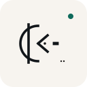

<p align="center">
  
</p>

# `@doldskrift/core`

<p align="center">
  <a href="https://github.com/theworker02/doldskrift/actions/workflows/ci.yml"></a>
  
  <a href="https://theworker02.github.io/doldskrift/"></a>
</p>

**Primary JavaScript SDK** for Doldskrift Open mode: encode/decode, session mappings, `.dsk` containers, discovery helpers, and browser DOM helpers.

**Doldskrift** — Swedish *dold* (hidden) + *skrift* (writing) → concealed script. Representation only — **not encryption**. Neural ≠ encryption; Protected AEAD is a separate profile (not in this package).

```ts
import { encode, decode, renderDoldskrift } from "@doldskrift/core";
import "@doldskrift/core/doldskrift.css";

decode(encode("hello agent"));
```

## Package map

| Package | Role |
|---------|------|
| **`@doldskrift/core`** (this) | Codec + constants + browser helpers |
| `@doldskrift/web` | Thin re-export adapter (prefer core) |
| `@doldskrift/react` | React component / hooks adapter |
| `doldskrift-bindings` | Generated WASM from Rust (canonical bridge) |

Rust remains the protocol source of truth. Constants sync with [`spec/protocol-constants.json`](../../spec/protocol-constants.json).

Logo: same mark as [`assets/brand/logo-mark.svg`](../../assets/brand/logo-mark.svg). Funding: [thanks.dev/u/gh/theworker02](https://thanks.dev/u/gh/theworker02).

[Root README](../../README.md) · [Docs](../../docs/guides/javascript.md) · [Site](https://theworker02.github.io/doldskrift/)
